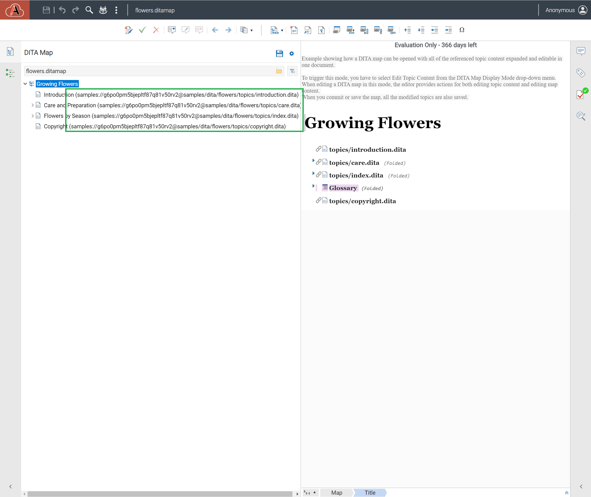

# dita-extension-custom-dita-map-node-renderering

A sample framework that customize rendering of the DITA Map nodes by installing a custom DITAMapNodeRendererCustomizer [1] that appends to each topicref its href.

--- 

- [0] https://www.oxygenxml.com/InstData/Editor/SDK/javadoc/ro/sync/exml/workspace/api/editor/page/ditamap/DITAMapNodeRendererCustomizer.html
