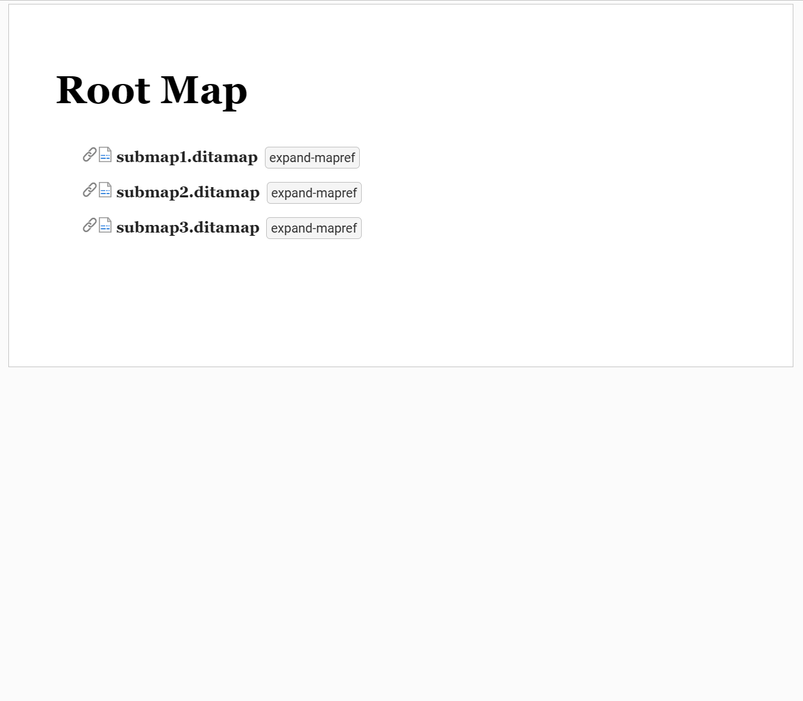

# dita-extension-expand-maprefs-on-demand

A sample framework that enables on-demand expansion of submaps by clicking a button. By default, submaps are expanded automatically, but this plugin can be helpful for improving loading times when opening maps with numerous submaps.

The solution works by defining a custom ro.sync.ecss.extensions.dita.map.topicref.DITAMapRefResolver that expands submaps only when they are assigned the "-oxy-expand-refs" pseudo-class. Clicking the button sets this pseudo-class and calls ro.sync.ecss.extensions.api.AuthorDocumentController.refreshNodeReferences(AuthorNode).

Installation:
1. build the framework by running "mvn clean package"
2. the resulted target/dita-extension-maprefs-on-demand-expansion-plugin.zip file contains the packed framework
2.1. for Oxygen XML Web Author, upload the zip file via the Administration page page under the Framework section.
2.2. for Oxygen XML Editor or Oxygen XML Author, unzip the archive, go to Options > Preferences > Document Type Association, and add it to the Additional Frameworks Directories list.

